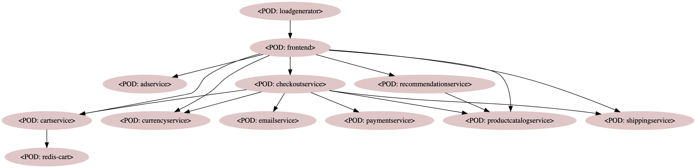
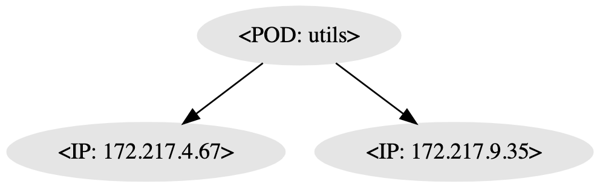

# Generating Kubernetes Network Policies By Sniffing Network Traffic

This project contains experimental scripts(bash & python) that creates [Kubernetes Network Policies](https://kubernetes.io/docs/concepts/services-networking/network-policies/) based on actual network traffic captured from applications running on a Kubernetes cluster.

## But why?

[Network Policies](https://kubernetes.io/docs/concepts/services-networking/network-policies/) are used for allowing/blocking network traffic of applications running on Kubernetes clusters. Enterprises which process critical customer data such as financial institutions(Banks, Insurances,etc. ) have quite strict security requirements and those that run applications on Kubernetes clusters are very likely to use *Network Policies*(or depending on the CNI plugin they use, something similar to it such as [Antrea's ClusterNetworkPolicy](https://github.com/vmware-tanzu/antrea/blob/a9adf5a58acee9bfb06fbe75b0f2d097ec362c99/docs/antrea-network-policy.md) or [CiliumNetworkPolicy](https://docs.cilium.io/en/v1.8/concepts/kubernetes/policy/#ciliumnetworkpolicy)) to control which ingress/egress network traffic is allowed for applications.

For simple applications such as a classical 3-tier architecture app that consists of a frontend, a backend that connects to a database, creating *Network Policies* is straight-forward. However, more complex applications that consists of many components(think about micro-service architecture based applications with many components) coming up with the right network policies that are precise (what we mean by precise here is, communication between two components is allowed only if there's an explicit need and it's allowed only on known ports) can be quite time consuming. And this is why we came up with a couple of scripts to make it easier to create standard(non CNI specific) Kubernetes Network Policies.

## How?

The mechanism behind the automation of  network policy generation is simple. It consists of the following steps described below:

### Capture network traffic

First of all, we need a way to capture network traffic of each pod running. We use the good old [tcpdump](https://en.wikipedia.org/wiki/Tcpdump) for capturing the traffic and the [kubernetes sidecar pattern](https://www.google.com/search?q=kubernetes+sidecar+pattern). For this to work, we need the right privileges for the pod/container that will run the [tcpdump image](https://hub.docker.com/r/dockersec/tcpdump) i.e. tcdump container needs to run with root user. We are aware that this might be a no-go in highly secure enterprise kubernetes installations. That said, the envisioned usage for the scripts in this repo is to run the apps in a cluster that: 
- Does not enforce Network Policies at all(or all ingress/egress traffice is allowed by using a Network Policy such as [this](https://kubernetes.io/docs/concepts/services-networking/network-policies/#default-allow-all-ingress-traffic) and [this](https://kubernetes.io/docs/concepts/services-networking/network-policies/#default-allow-all-egress-traffic))
- Allows a pod to run with user root

In the case where policy generation happens on one cluster and application runs in a different cluster, you will need to make sure that the IPs,FQDNs specified for Network Policies are adjusted accordingly for the target environment. For example if  there is an egress Network Policy that is used for connecting to a Oracle database running on IP 10.2.3.4 and if this IP is different on the actual target environment where the application would be deployed, you will need to adjust that IP.

### Generate network traffic

In order to create the right Network Policies, we need to capture network traffic that would represent all the use cases, thus all potential network communication related to the application. It's up to you to make sure that during the time the network traffic is captured, you generate meaningful load on the application. For example, if your application is a REST based web application, you would make sure that you hit all the relevant REST endpoints. If the application does some processing based on messages received from a MessageQueue, it's up to you send those messages to the queue so that the applications is performs what it would normally perform in production.

### Collect capture files and Kubernetes data

Tcpdump sidecar container runs tcpdump with the following command: ```tcpdump -w /tmp/tcpdump.pcap```. So before we can analyse the traffic, we need to collect all the pcap files from pods. Moreover, we also need some metadata from Kubernetes. We will capture information about Kubernetes resources such as Services, Deployments, ReplicaSets so that later we can use that to analyse which IP is owned by which application.

### Analyse data & Generate Network Policies

After collecting all the packet capture and kubernetes data about IPs, Ports, Labels now we can build a graph. In this graph, nodes/vertices would represent pods and edges would be the network communication between these pods. In the python script that generates the network policies,  first a graph is build and in the second part edges are traversed and for each edge a Network Policy is generated.

## Action!

Let's go through the steps below and see if we can generate network policies for a test application. The test application is a micro-service demo application from Google that can be found [here](https://github.com/GoogleCloudPlatform/microservices-demo).

### Deploy the test application

Before you run the following commands, check out the value set for *TARGET_NS*. By default it's *netpol-demo*, you can update it if need be.

### Prepare environment
You need access to a Kubernetes cluster and you will need the following tools installed:
- Kubernetes CLI
- Python (v3)
- Pip(to manage python dependencies) (v3)
- Tshark which is a Terminal-based [Wireshark](https://www.wireshark.org/) (see [here](https://www.wireshark.org/docs/man-pages/tshark.html))
- [Cut](https://man7.org/linux/man-pages/man1/cut.1.html)
- [Jq](https://stedolan.github.io/jq/)
To install python dependencies, run the following command from top project folder: ```pip install -r requirements.txt```

We've tested the scripts in this repo on Mac OS and Linux.

### Deploy a test application

```env.sh``` file on the top-level project folder contains some variables that are used in multiple scripts. Please override those variables with your preferred values, e.g. **TARGET_NS** is the Kubernetes namespace which will be used for all scripts.

The excerpt below is used to create a Kubernetes and then deploy a test application.
The test application in this case is a microservice demo application that can be found in this [repo](https://github.com/GoogleCloudPlatform/microservices-demo). You can however use any application that you fancy.

```bash
source env.sh
# create a namespace if it does not already exist
kubectl create ns $TARGET_NS --dry-run -o yaml  | kubectl apply -f -
# deploy application
kubectl apply -f https://raw.githubusercontent.com/GoogleCloudPlatform/microservices-demo/cbd3c9643400de7471807821e212a6f3db38ed14/release/kubernetes-manifests.yaml -n ${TARGET_NS}
```

### Patch deployments in $TARGET_NS 
Running the following command: ```./1-inject-sidecar.sh ``` patches all the deployments and injects a sidecar container that runs tcpdump with the following command: ```tcpdump -w /tmp/tcpdump.pcap```. In our test application, we only have pods that are controlled by deployments. If you are to use a different application that the demo google app used here, you will need to adopt the sidecar injection mechanism.

### Prepare to copy capture and metadata

Notice that the script below(*2-copy-capture-and-metadata.sh*) will capture pod names and then it will print out that it will wait for *TEST_DURATION_IN_SECONDS*. During this duration, you should 'load' the application so that network traffic that covers all the potential communication patterns in a real-world use case is generated.

Run the command below:

```./2-copy-capture-and-metadata.sh```


If you run into a issue while running this script, you can re-run it. Bear in mind, though that you will need to make sure that app traffic is generated also during the re-run.

### Generate traffic
In the case of our demo application, there is pod called *load-generator* that will be deployed with the rest of the other app components. This pod keeps calling the ui to generate application flows. You can see the logs from *load-generator* pod by running ```kubectl -n $TARGET_NS logs $(kubectl get pods -l app=loadgenerator -o jsonpath='{.items[0].metadata.name}' -n $TARGET_NS) -c main```. So you don't need to do anything extra if you use the same Google microservice demo application to generate network traffic. However if yo use another application, you will need to run your own load generation tool while the script *./2-copy-capture-and-metadata.sh* keeps printing out that message: 'Going to wait for X seconds so that application traffic can be generated...'

### Analyse data & build NetworkPolicies
Run the command below to analyse the data and generate NetworkPolicies. The input to the script is a capture json file that is prefixed with *capture-*. You can find candidate capture file(s) by running ```ls .tmp/capture-*.json```.

```bash
./3-analyse.py .tmp/capture-XXX.json 
```

Generated NetworkPolicies should be in  *.tmp/network-policies* folder. For our demo application, we generated one NetworkPolicy file for each application including both ingress and egress rules. Moreover, a DNS policy that allows egress communication on port 53 is created by default.

There's also a graph(in [DOT](https://graphviz.org/doc/info/lang.html) format) generated as a result of running the *3-analyse.py* script. You can use an online tool such as [this](https://dreampuf.github.io/GraphvizOnline) or [this](https://edotor.net/) to create a visual representation of the graph. Here are some example images created via dot representation.





### Clean-up

The tcpdump sidecar keeps capturing network traffic as long as it's running. So don't forget to remove those sidecar containers after you're done. Run ```./4-delete-sidecar.sh``` to get rid of the tcpdump sidecar containers.

### Gotchas

Scripts in this repo were created in a proof of concept setting, code quality has room for improvement. There are some limitations:

- Scripts were developed to generate NetworkPolicies for  applications that runs pods running in a single namespace. So if there are calls happening to other namespaces than where the application is running, network policies will not be correctly handled.

- Network policy rules for traffic to/from outside of cluster is IP based. If the applications communicates with a domain that is backed my multiples IPs, there will be NetworkPolicy rules only for the IPs that were resolved during the time the scripts ran. So, you might end up missing some rules.

- Only TCP traffic is analysed. There's a NetworkPolicy for DNS generated but there will be no other UDP based NetworkPolicies created.

Feel free to extend these scripts to cover more use cases.
