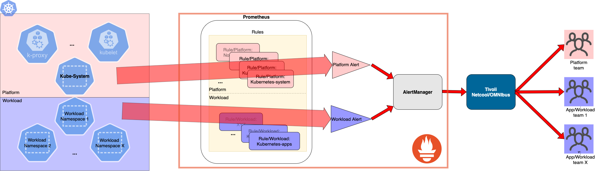

Recently, we've worked with a customer on a Kubernetes monitoring solution where we had to fulfil the following requirements:
1. Deploy [Prometheus](https://prometheus.io) with easy lifecycling in mind. What I mean by easy lifecycling is upgrading Prometheus instances with minimal effort and have reproducable deployments 
1. Have an initial set of alerting rules in place to cover basic platform & app monitoring needs
1. Forward alerts to [IBM's Tivoli Netcool/OMNIbus](https://www.ibm.com/support/knowledgecenter/SSSHTQ/landingpage/NetcoolOMNIbus.html) with a label that uniquely identifies the source of the alert

In this article, we will talk about how we came up with a design to fullfil these requirements agobe.
We will not cover Prometheus fundamental knowledge in this article, there are enough sources on the web to learn the basics by yourself.


## Helm Chart: kube-prometheus-stack
For taking care of the first two requirements,[kube-prometheus-stack](https://github.com/prometheus-community/helm-charts/tree/main/charts/kube-prometheus-stack) can be used. This helm chart was formerly named [prometheus-operator](https://github.com/helm/charts/tree/master/stable/prometheus-operator). You can find the details of the kube-prometheus (which includes the Prometheus operator,as well as other useful bits) [here](https://github.com/prometheus-operator/kube-prometheus).

[Helm charts](https://helm.sh/docs/topics/charts/) are one of the most common ways to deploy software on Kubernetes these days and having an [operator](https://kubernetes.io/docs/concepts/extend-kubernetes/operator) for software also comes in handy for operations such as upgrading software version,backup/restore and many other actions that would be typically triggered by administrator of software manually on day 2.

### Prometheus rulez :)
The other interesting thing that comes with **kube-prometheus-stack** helm chart is a set of rules that covers most common needs for Kubernetes platforms. 
The rules are listed [here](https://github.com/prometheus-community/helm-charts/tree/main/charts/kube-prometheus-stack/templates/prometheus/rules) and Prometheus rules are simply wrapped inside a [custom resource](https://kubernetes.io/docs/concepts/extend-kubernetes/api-extension/custom-resources/) with the following kind: 
```
apiVersion: monitoring.coreos.com/v1 
kind: PrometheusRule
```

One should bear in mind that, although these rules are good to start with, typically a team responsible for managing K8S platforms will most probably decide to tweak those rules, add new ones, remove some of them over time as they see fit.

Rules listed [here](https://github.com/prometheus-community/helm-charts/tree/main/charts/kube-prometheus-stack/templates/prometheus/rules) cover two main themes for alerts. Most of rules are for monitoring a Kubernetes platform itself and meant to be taken care by operators of the platform. However, there are also rules concerning workloads running on  K8s, e.g. [kubernetes-apps.yaml](https://github.com/prometheus-community/helm-charts/tree/main/charts/kube-prometheus-stack/templates/prometheus/rules/kubernetes-apps.yaml). Alerts that are triggered due to platform events should be routed differently than workload alerts and this is why we need to differentiate between platform/system vs. workload. In other words, different individuals/team should be alerted based on Prometheus rules. In the rest of this post, we will go into details of how Prometheus was configured to always include a custom label with the right value i.e. Platform ID or Workload ID.


## Solution Design

Image below captures the overall system design.



Overall goal is to differentiate between platform level alerts vs alerts that would originate from workload that runs on the cluster i.e. application alerts. Team(s) that are responsible for operating K8S clusters are typically different than teams which run workloads on those clusters. So for making sure that alerts can be routed to the right teams, we need some identifiers that can be used on Tivoli Netcool/OMNIbus side to make the right routing call. We will not go into details how Tivoli Netcool/OMNIbus can be configured to route alerts to different teams. 

As Tivoli Netcool/OMNIbus can receive http calls, we will be using webhooks to send alerts from [Prometheus/Alertmanager](https://prometheus.io/docs/alerting/latest/alertmanager/) to Tivoli Netcool/OMNIbus. The only thing that will be required for making the right routing on Tivoli side is a label that we will send as a part of alert data. The key for this label is decided as **label_example_com_ci_monitoring**.

### Rules Configuration
[This file](values.yml.j2) includes the custom configuration we came up with for the Prometheus Operator deployment. It's a jinja template file, and the reason for that is we replace certain values in that template depending on target K8S cluster such as cluster-name, container image registry hostname, alert sending destinations (email, webhook). All helm charts come with a default *values.yml* file and our jinja template is based on [this file](https://github.com/prometheus-community/helm-charts/blob/main/charts/kube-prometheus-stack/values.yaml).


Prometheus operator comes with a set of Alerting rules that are [enabled by default)(https://github.com/prometheus-community/helm-charts/blob/564086af6157d2da6a9a5f086010f1cb3a93babd/charts/kube-prometheus-stack/values.yaml#L30) and due to our need of overwriting [kubernetesApps rules]((https://github.com/prometheus-community/helm-charts/tree/main/charts/kube-prometheus-stack/templates/prometheus/rules/kubernetes-apps.yaml)),  the following section in values file is included to disable creation of **KubernetApps** rules:
```yaml
defaultRules:
  create: true
  rules:
    kubernetesApps: false
```

After that,we start adding our own version of the *kubernetesApps* rules:
```yaml
## Provide custom recording or alerting rules to be deployed into the cluster.
additionalPrometheusRules:
  - name: kubernetes-apps
    groups:
      - name: kubernetes-apps
        rules:
        - alert: KubePodCrashLooping-System
          annotations:
            message: Pod {{ $labels.namespace }}/{{ $labels.pod }} ({{ $labels.container
              }}) is restarting {{ printf "%.2f" $value }} times / 5 minutes.
            runbook_url: https://github.com/kubernetes-monitoring/kubernetes-mixin/tree/master/runbook.md#alert-name-kubepodcrashlooping
          expr: rate(kube_pod_container_status_restarts_total{job="kube-state-metrics",
            namespace=~"[% system_namespaces_regex %]"}[15m]) * 60 * 5 > 0
          for: 15m
          labels:
            severity: critical
            label_example_com_ci_monitoring: [% ci_cluster_id %]
        - alert: KubePodCrashLooping
          annotations:
            message: Pod {{ $labels.namespace }}/{{ $labels.pod }} ({{ $labels.container
              }}) is restarting {{ printf "%.2f" $value }} times / 5 minutes.
            runbook_url: https://github.com/kubernetes-monitoring/kubernetes-mixin/tree/master/runbook.md#alert-name-kubepodcrashlooping
          expr: rate(kube_pod_container_status_restarts_total{job="kube-state-metrics",
            namespace!~"[% system_namespaces_regex %]"}[15m]) * 60 * 5 > 0
          for: 15m
          labels:
            severity: critical
```
The rules are based on the original [kubernetes-apps.yaml](https://github.com/helm/charts/blob/master/stable/prometheus-operator/templates/prometheus/rules/kubernetes-apps.yaml) and we add two versions for each rule. One for application namespaces and one for system namespaces. 
For controlling what a system namespace is we use a jinja placeholder: ```[% system_namespaces_regex %]``` and the value we've used for this placeholder is: ```default|kube-system|pks-system|k8s-monitoring```. As mentioned 

We add labels to Prometheus alerts that are sent from AlertManageer to Tivoli side and we make sure that alert queries that are relevant for applications always include that label. In our configuration, this label is called *label_example_com_ci_monitoring*.

For system relevant alerts, we include a label to represent Cluster ID which is again controlled by a jinja placeholder ```[% ci_cluster_id %]```.  Here is the relevant section:
```yaml
      - alert: KubePodCrashLooping-System
          annotations:
            message: Pod {{ $labels.namespace }}/{{ $labels.pod }} ({{ $labels.container
              }}) is restarting {{ printf "%.2f" $value }} times / 5 minutes.
            runbook_url: https://github.com/kubernetes-monitoring/kubernetes-mixin/tree/master/runbook.md#alert-name-kubepodcrashlooping
          expr: rate(kube_pod_container_status_restarts_total{job="kube-state-metrics",
            namespace=~"[% system_namespaces_regex %]"}[15m]) * 60 * 5 > 0
          for: 15m
          labels:
            severity: critical
            label_example_com_ci_monitoring: [% ci_cluster_id %]
```

For workload alerts, we have a mechanism to automatically populate *label_example_com_ci_monitoring* on the fly based on cluster and namespace. Moreover, if there's an existing label on the metric with key *label_example_com_ci_monitoring*, it will be kept as is. In the next section we explain how this mechanism works.

### Additional Alert Relabellings
In helm values file, in a section with path *prometheus.prometheusSpec.externalLabels* , we have some additional alert relabeling that we introduced for putting some extra labels on each alert triggerred from this Prometheus instance. We thought K8S cluster ID, which is controlled by a jinja placeholder(``` [% ci_cluster_id %] ```) , could bring a lot of benefit in the future to denote the source of an alert. The key for this label is set as *label_example_com_ci_cluster* and not to be mixed up with  *label_example_com_ci_monitoring*. Purpose of this label is to always show the source K8S platform, independent from whether it's a system or namespace/workload alert. The relevant configuration looks like this:

```yaml
  prometheusSpec:
    logLevel: info
    externalLabels:
      label_example_com_ci_cluster: [% ci_cluster_id %]
```

The following section that is under path: *prometheus.prometheusSpec.additionalAlertRelabelConfigs* controls how we control [relabellings](https://prometheus.io/docs/prometheus/latest/configuration/configuration/#alert_relabel_configs) of alerts sent out from AlertManager:
```yaml
    additionalAlertRelabelConfigs:
    - source_labels:
        - label_example_com_ci_cluster
      action: replace
      regex: (.*)
      replacement: "[% ci_cluster_id %]"
      target_label: __tmp_monitoring
    - source_labels:
       - namespace
      regex: (.+)
      replacement: "NS-${1}-[% ci_cluster_id %]"
      target_label: __tmp_monitoring
      action: replace
    - source_labels:
        - label_example_com_ci_monitoring
      action: replace
      regex: (.+)
      target_label: __tmp_monitoring
    - source_labels:
        - __tmp_monitoring
      action: replace
      regex: (.*)
      replacement: "$1"
      target_label: label_example_com_ci_monitoring
```

Prometheus relabeling rules are processed in the same order they are in the yaml document and this allows us to:
1. Populate a temporary variable called *__tmp_monitoring* with a value coming from ```label_example_com_ci_cluster```.
1. If there is a label with key ```namespace```, we take its value and use it to create our own expression  ```"NS-${1}-[% ci_cluster_id %]"```. The ```${1}``` section here captures the namespace value and the second part ```[% ci_cluster_id %]``` is our jinja placeholder.
1. If there is an existing label called *label_example_com_ci_monitoring* put the value of that label into existing variable: *__tmp_monitoring*
1. Finally replace label *label_example_com_ci_monitoring*'s with the temporary label value.

In other words, with this configuration above we always apply a label with the key: *label_example_com_ci_monitoring* and the value of this key is either the original value of key *label_example_com_ci_monitoring* if it's there and if that label does not exist, we generate a value based on namespace and cluster using a pattern: ```NS-${1}-[% ci_cluster_id %]``` if there's a label with *namespace* as its key. If there's not a label with key: *namespace* then we fall back to *ci_cluster_id*.

In this context, it would be good to remind you that there's a conversion process that takes place when scraping data from Kubernetes into Prometheus. During this conversion a key such as **example.com/ci_monitoring** would be translated in Prometheus into a label called *label_example_com_ci_monitoring*.

### Persistency

Prometheus Operator helm chart comes with persistent volumes disabled by default. In order to enable and configure persistent volumes, the following section is used. 
```yaml
      volumeClaimTemplate:
        spec:
          accessModes: ["ReadWriteOnce"]
          resources:
            requests:
              storage: 50Gi
```

This section is avaiable under path: *prometheus.prometheusSpec.storageSpec*. We have not specified a storage class and we assume that there is a default storageclass configured for the cluster. Alternatively, in the *spec* section, you can specify a storage class  as shown below:
```yaml 
      volumeClaimTemplate:
        spec:
          accessModes: ["ReadWriteOnce"]
          storageClassName: XYZ
          resources:
            requests:
              storage: 50Gi
```              

### Alertmanager configuration

This excerpt below shows how *Prometheus Alertmanager* can be configured to forward alerts:
```yaml
alertmanager:
  enabled: true

  config:
    global: {}
    receivers:
    - name: default-receiver
      webhook_configs:
      - url: "[% alertmanager_webhook_url %]"
        send_resolved: true
      email_configs:
      - send_resolved: true
        to: [% alertmanager_smtp_to %]
        from: [% alertmanager_smtp_from %]
        smarthost: [% alertmanager_smtp_host %]
        require_tls: false
    - name: 'null'
    route:
      group_by: ['job']
      group_wait: 30s
      group_interval: 5m
      repeat_interval: 24h
      receiver: default-receiver
```
There are a total of 2 receivers configured in the section above. The first one is called *default-receiver* and this one has **web_hook** and **email** actions that are triggered when an alert is raised. *Webhook* integration allows you send alerts to any http capable endpoint such as IBM Tivoli Netcool/OMNIbus. See [here](https://prometheus.io/docs/alerting/latest/configuration/#webhook_config) for details about configuring webhook listeners. In the *default-receiver* section, email is the second receiver for any points which can be quick way to test things out if you have access to a email server that uses smtp protocol.
During testing purposes, if you want to avoid sending alerts to third parties, you can use the ```null``` receiver. 

### Watchdog

If prometheus gets deployed on the K8S platform that you want to observe, you risk not gettting any alerts because Prometheus could potentially not run if platform does not run properly or at all.